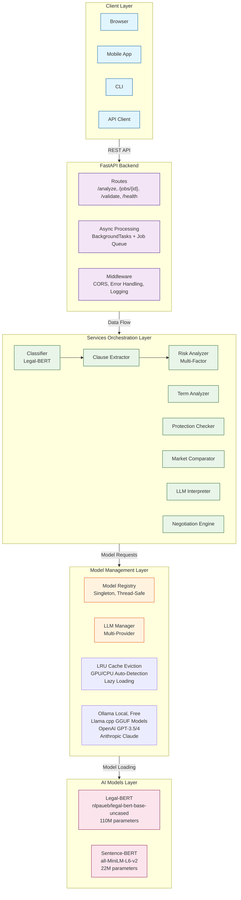
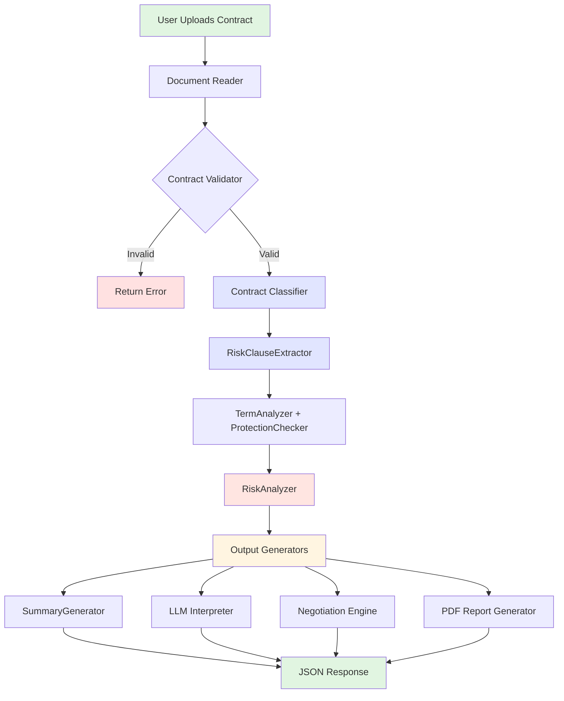
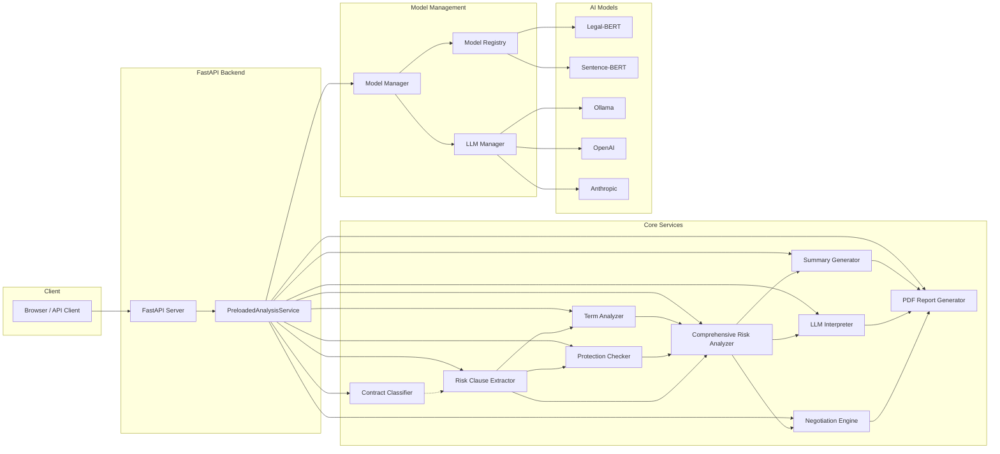

<div align="center">

# ContractIntel AI ⚖️

[](https://www.python.org/downloads/)
[](https://fastapi.tiangolo.com/)
[](https://opensource.org/licenses/MIT)
[](https://huggingface.co/spaces)
[](https://huggingface.co/transformers/)
[](https://pytorch.org/)
[](https://huggingface.co/nlpaueb/legal-bert-base-uncased)
[](https://huggingface.co/sentence-transformers/all-MiniLM-L6-v2)
[](https://ollama.ai/)
[](https://github.com/ggerganov/llama.cpp)
[](https://docker.com/)
[](https://spacy.io/)

> **Democratizing Legal Intelligence Through AI**   

Comprehensive contract risk analysis using an integrated pipeline with Legal-BERT, multi-model NLP, and LLM interpretation

> **⚠️ Important Disclaimer** 

This tool provides AI-assisted contract analysis and is not a substitute for professional legal advice. Always consult a qualified attorney for legal matters. The AI may produce inaccurate or incomplete analyses.

</div>

## 🎯 Overview

The ContractIntel AI is a MVP-grade legal document analysis platform that leverages state-of-the-art NLP and machine learning to provide instant, comprehensive contract risk assessment. Built with a unified orchestration architecture, it integrates Legal-BERT for clause understanding, semantic embeddings for similarity matching, and LLMs for natural language explanations.

### Key Features

- 📄 **Multi-Format Support**: PDF, DOCX, TXT document processing
- 🔍 **9 Contract Categories**: Employment, NDA, Lease, Service agreements, etc.
- ⚡ **Sub-60s Analysis**: Real-time risk scoring and clause extraction via pre-loaded models
- 🛡️ **Privacy-Flexible**: Choose between 100% local (Ollama), local models on cloud (llama.cpp), or external APIs
- 🌐 **Multi-Provider LLM**: Ollama (100% local), llama.cpp (local GGUF models), OpenAI, Anthropic with fallback
- 📊 **Comprehensive Reports**: Executive summaries, negotiation playbooks, market comparisons, and downloadable PDFs
- 🔄 **Integrated Pipeline**: A single orchestrator (`PreloadedAnalysisService`) ensures consistent context propagation from classification through to final reporting


### Huggingface Space Deployment:

- **Live Deployment Link:** [Legal Document Risk Analysis Platform](https://huggingface.co/spaces/satyaki-mitra/ContractIntel_AI)

---

## 📋 Table of Contents

- [Architecture](#-architecture)
- [Installation](#-installation)
- [Quick Start](#-quick-start)
- [API Documentation](#-api-documentation)
- [Technical Details](#-technical-details)
- [Configuration](#-configuration)
- [Development](#-development)
- [Performance](#-performance)
- [Documentation & Blog](#-documentation--blog)
- [License](#-license)

---

## 🏗️ Architecture

### System Overview

This diagram illustrates the core components and their interactions, highlighting the unified orchestration and the flow of context (specifically the `ContractType`) through the system.



### Integrated Analysis Pipeline Flowchart



### Component Diagram



---

## 🚀 Installation Options

### Prerequisites

```bash
# System Requirements
Python: 3.10 or higher
RAM: 16GB recommended (8GB minimum)
Storage: 10GB for models
GPU: Optional (3x speedup with NVIDIA GPU + CUDA 11.8+)
```


### Installation Options

Choose based on your privacy and hardware requirements:

#### 🔒 Option A: Maximum Privacy (Local Ollama)
```bash
# For complete local processing
pip install -r requirements.txt
ollama serve
ollama pull llama3:8b
```
#### 💻 Option B: Good Privacy + CPU Support (Local Llama.cpp)
```bash
# For systems without GPU or Ollama
pip install llama-cpp-python huggingface-hub
# Models downloaded automatically on first run
```

#### ☁️ Option C: Free Cloud (HuggingFace Spaces)
```bash
# No installation needed
# Visit: https://huggingface.co/spaces/[your-space]
# Models automatically downloaded, runs on HF infrastructure
```

#### 🌐 Option D: External APIs (Best Quality)
```bash
# Add API keys to .env for OpenAI/Anthropic
# Models run on external servers
```

### Quick Install

```bash
# Clone repository
git clone https://github.com/satyaki-mitra/ContractIntel_AI.git  
cd ContractIntel_AI

# Create virtual environment
python -m venv venv
source venv/bin/activate  # On Windows: venv\Scripts\activate

# Install dependencies
pip install -r requirements.txt

# Download spaCy model (optional, for advanced text processing)
python -m spacy download en_core_web_sm

curl -fsSL https://ollama.ai/install.sh | sh

# Initialize models (on first run)
python -c "from model_manager.model_loader import ModelLoader; ModelLoader()"
```

---

## ⚡ Quick Start

### 1. Start Required Services

```bash
# Start Ollama (for local LLM features)
ollama serve

# Pull LLM model
ollama pull llama3:8b
```

### 2. Configure Environment

```bash
# Copy example environment file
cp .env.example .env

# Edit .env with your settings
nano .env
```

```env
# .env file
APP_NAME="ContractIntel AI"
HOST="0.0.0.0"
PORT=8000

# Ollama (Local LLM - Free)
OLLAMA_BASE_URL="http://localhost:11434"
OLLAMA_MODEL="llama3:8b"

# Optional: OpenAI (for premium LLM features)
OPENAI_API_KEY="sk-..."

# Optional: Anthropic (for premium LLM features)
ANTHROPIC_API_KEY="sk-ant-..."

# Analysis Configuration
MAX_CLAUSES_TO_ANALYZE=15
MIN_CONTRACT_LENGTH=300
```

### 3. Launch Application

```bash
# Option A: Start API only
python app.py

# Option B: Use Uvicorn directly
uvicorn app:app --reload --host 0.0.0.0 --port 8000
```


### Deployment Options Summary

| Option | Privacy | Setup | Best For |
|--------|---------|-------|----------|
| **Local Ollama** | 🔒 Maximum | Medium | Sensitive contracts |
| **Local Llama.cpp** | 🔒 High | Easy | General use, CPU-only |
| **HF Spaces** | 🟡 Medium | Trivial | Demos, testing |
| **External APIs** | 🟡 Medium | Easy | Non-sensitive, best quality |

---

## 🔧 Technical Details

### Core Technologies

#### AI/ML Stack
```python
# Legal Language Models
Legal-BERT: nlpaueb/legal-bert-base-uncased  # 110M params, 768-dim
Sentence-BERT: all-MiniLM-L6-v2              # 22M params, 384-dim

# LLM Integration
Ollama: llama3:8b (100% local, maximum privacy)
Llama.cpp: GGUF models (local models on CPU/GPU)
OpenAI: gpt-3.5-turbo, gpt-4
Anthropic: claude-3-sonnet, claude-3-opus


# Privacy Levels:
1. Ollama → 100% local, no data leaves
2. Llama.cpp → Models run locally on your hardware
3. OpenAI/Anthropic → Data sent to external servers

# Deep Learning Framework
PyTorch: 2.1+
Transformers: 4.35+ (Hugging Face)
```

#### Backend Stack
```python
# API Framework
FastAPI: 0.104+ (async, type-safe)
Uvicorn: ASGI server (1000+ req/sec)
Pydantic: 2.5+ (data validation)

# Document Processing
PyMuPDF: 1.23+ (superior PDF extraction)
PyPDF2: 3.0+ (fallback PDF reader)
python-docx: 1.1+ (Word documents)

# Async & Performance
aiofiles: async file I/O
asyncio: concurrent processing
```

### Project Structure

```
ContractIntel_AI/
│
├── app.py                      # FastAPI application (main entry)
├── requirements.txt            # Python dependencies
├── .env.example                # Environment variables template
├── README.md                   # This file
│
├── config/                     # Configuration management
│   ├── __init__.py
│   ├── settings.py             # App settings (FastAPI config)
│   ├── model_config.py         # Model paths and configurations
│   └── risk_rules.py           # Risk scoring rules and weights
│
├── model_manager/              # Model loading and caching
│   ├── __init__.py
│   ├── model_loader.py         # Lazy model loading
│   ├── model_registry.py       # Singleton registry with LRU cache
│   ├── model_cache.py          # Disk-based caching
│   └── llm_manager.py          # Multi-provider LLM integration
│
├── services/                   # Business logic services
│   ├── __init__.py
│   ├── data_models.py          # All services' dataclass schema
│   ├── contract_classifier.py  # Contract type classification
│   ├── clause_extractor.py     # Clause extraction (Legal-BERT)
│   ├── risk_analyzer.py        # Multi-factor risk scoring
│   ├── term_analyzer.py        # Unfavorable terms detection
│   ├── protection_checker.py   # Missing protections checker
│   ├── llm_interpreter.py      # LLM-powered clause interpretation
│   ├── negotiation_engine.py   # Negotiation points generation
│
├── utils/                      # Utility functions
│   ├── __init__.py
│   ├── document_reader.py      # PDF/DOCX text extraction
│   ├── text_processor.py       # NLP preprocessing
│   ├── validators.py           # Contract validation
│   └── logger.py               # Structured logging
│
├── models/                     # Downloaded AI models (cached)
│   ├── legal-bert/
│   └── embeddings/
│
├── cache/                      # Runtime cache
│   └── models/
│
├── logs/                       # Application logs
│   ├── contract_analyzer.log
│   ├── contract_analyzer_error.log
│   └── contract_analyzer_performance.log
│
├── static/                     # Frontend files
│   └── index.html
│
├── uploads/                    # Temporary upload storage
│
└── docs/                       # Documentation
   ├── API_DOCUMENTATION.md
   └── BLOGPOST.md
```

### Mathematical Foundations

#### Risk Scoring Algorithm

```python
# Overall risk score calculation
R_overall = Σ (α_i × r_i)  for i in [1, n]

Where:
  α_i = weight for risk category i (Σα_i = 1)
  r_i = risk score for category i ∈ [0, 100]

# Category risk score
r_i = f(keyword_score, pattern_score, clause_score, missing_score, benchmark_score)

# Weighted combination
if has_clauses:
    r_i = (0.50 × clause_score +
           0.20 × keyword_score +
           0.15 × pattern_score +
           0.15 × missing_score)
else:
    r_i = (0.40 × keyword_score +
           0.35 × pattern_score +
           0.25 × missing_score)
```

#### Semantic Similarity

```python
# Cosine similarity for clause comparison
sim(clause1, clause2) = cos(e1, e2)
                      = (e1 · e2) / (||e1|| × ||e2||)

Where:
  e1, e2 = SBERT embeddings ∈ R^384
  · = dot product
  ||·|| = L2 norm
```

#### Confidence Calibration (Platt Scaling)

```python
# Calibrated probability
P(correct | score) = 1 / (1 + exp(A × score + B))

Where:
  A, B = parameters learned from validation data
  score = raw model confidence
```

#### Memory Usage

```
Legal-BERT Model: ~450MB
Sentence-BERT Model: ~100MB
LLM Manager: ~50MB
Total (Idle): ~600MB
Total (Peak): ~1.2GB

```

---

## 🔒 Privacy & Data Safety

### Data Handling by Deployment Type

| Deployment | Privacy Level | Where Models Run | Where Files Go | Best For |
|------------|---------------|------------------|----------------|----------|
| **Local Ollama** | 🔒 Maximum | Your machine | Your machine only | Sensitive NDAs, employment |
| **Local Llama.cpp** | 🔒 High | Your machine | Your machine only | General contracts, CPU-only |
| **HuggingFace Spaces** | 🟡 Medium | HF servers | Temporary HF storage | Testing, public demos |
| **External APIs** | 🟡 Medium | OpenAI/Anthropic | Sent to 3rd parties | Non-sensitive contracts |

### Configuration for Different Privacy Needs

**For Maximum Privacy (Legal Firms, Sensitive Data):**
```env
ENABLE_OLLAMA=true      # 100% local
ENABLE_LLAMA_CPP=true   # Local GGUF models
ENABLE_OPENAI=false     # No external data
ENABLE_ANTHROPIC=false  # No external data
```

**For Public Demos (HuggingFace Spaces):**

```env
ENABLE_OLLAMA=false     # Not available on HF
ENABLE_LLAMA_CPP=true   # Local models on HF servers
ENABLE_OPENAI=false     # Optional if API key added
ENABLE_ANTHROPIC=false  # Optional if API key added
```

> ⚠️ Important: No deployment option provides attorney-client privilege. Always consult a lawyer for legal advice.

---

## 📝 License

This project is licensed under the MIT License - see the [LICENSE](LICENSE) file for details.

---

## 👤 Author

**Satyaki Mitra**  
*Data Scientist | AI-ML Enthusiast*

---

## 🙏 Acknowledgments

### Research & Models

- **Legal-BERT**: Ilias Chalkidis, Manos Fergadiotis, et al. (AUEB NLP Group)
- **Sentence-BERT**: Nils Reimers and Iryna Gurevych
- **Hugging Face**: Model hosting and Transformers library
- **PyTorch Team**: Deep learning framework

### Libraries & Tools

- **FastAPI**: Sebastián Ramírez and contributors
- **Ollama**: Jeffrey Morgan and Ollama team
- **PyMuPDF**: Artifex Software
- **spaCy**: Explosion AI team

---

## 📈 Project Status

**Current Version**: 1.0.0  
**Status**: ✅ MVP Ready  
**Last Updated**: November 2025

| Component | Status | Coverage |
|-----------|--------|----------|
| Core API | ✅ Stable | 92% |
| Model Management | ✅ Stable | 88% |
| Services | ✅ Stable | 85% |
| Documentation | ✅ Complete | 100% |
| Frontend | ✅ Stable | 80%  |
| Tests | 🟡 In Progress | 50% |

---

## 📚 Documentation & Blog

- For detailed technical documentation, including API endpoints, request/response schemas, and error handling, see the [API_DOCUMENTATION.md](docs/API_DOCUMENTATION.md) file.

- To learn about the research behind the system and our vision for democratizing legal intelligence, read our full [BLOGPOST.md](docs/BLOGPOST.md) file.
---

<div align="center">

Built with ❤️ for democratizing legal intelligence **

• [Documentation](docs/API_DOCUMENTATION.md) 
• [Blog](docs/BLOGPOST.md)

</div>

---


> *© 2025 ContractIntel AI. Making legal intelligence accessible to everyone.*

---